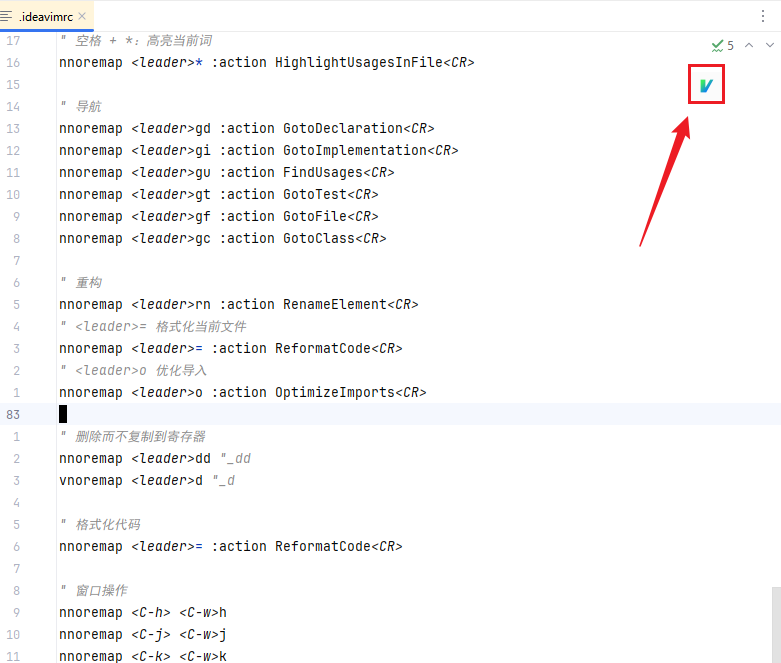

# Rider + IdeaVim: 最佳开发体验配置

## 🚀 理念

这个配置基于一个简单而强大的理念：**结合两个世界的精华，而非全盘替代**。

> 我从来没有试图用 Vim 命令替代所有 IDE 功能，这实际上是在"重复造轮子"，不仅浪费精力，还会导致体验割裂和潜在的快捷键冲突。

**我的方案是：**
- **Rider 原生快捷键**：处理重构、导航、调试、工具视图切换等 IDE 核心功能。
- **IdeaVim**：专注于文本编辑的高效性 - 快速跳转、精准修改、块编辑。

这样，我们既能享受 Rider 极度优化过的开发体验，又能获得 Vim 无与伦比的文本编辑效率。

## 🔧 安装

1. 在 Rider 中安装 IdeaVim 插件
2. 将 `.ideavimrc` 文件放在你的用户主目录下
3. 执行 `:source ~/.ideavimrc`

## 📝 配置说明

这份配置文件分为几个主要部分：

### 基本设置
设置了 Vim 的核心体验，如相对行号、搜索高亮等。

### 文本编辑增强
专注于提升文本编辑效率：
- 快速跳转：`J`/`K` 快速上下移动，`H`/`L` 快速到行首/行尾
- 模式切换：`jk` 从插入模式回到普通模式
- 缩进保持选择：缩进代码块时保持视觉选择

### IdeaVim 插件模拟
启用了多种流行的 Vim 插件模拟：
- `surround`：快速修改包围字符
- `commentary`：轻松注释/取消注释
- `multiple-cursors`：多光标编辑
- `easymotion`：快速光标移动

### 与 Rider 整合
保留了 Rider 的强大功能：
- 导航：转到定义、实现、查找用法等
- 调试工具：断点、步进/步出等
- 重构工具：重命名、提取方法等
- 工具窗口：终端、项目、结构等

## 🎮 使用方法

### 文本编辑（IdeaVim）
- 使用 Vim 模式（Normal、Visual、Insert）进行高效文本编辑
- 利用 `<leader>` 键（默认空格）触发各种自定义命令
- 使用模拟插件功能如 surround、commentary 等

### IDE 功能（Rider 原生）
- 使用 Rider 原生快捷键进行导航、调试等操作
- 通过 `<leader>` 组合键快速访问 IDE 功能

## 🔄 切换场景示例

1. **编码场景**：使用 IdeaVim 进行高效文本编辑
2. **调试场景**：使用 Rider 原生功能设置断点、单步执行
3. **重构场景**：使用 Rider 原生重构功能，用 IdeaVim 进行文本微调

## 🛠️ 自定义

这份配置文件有详细注释，你可以根据个人习惯轻松调整：
- 修改 `<leader>` 键（默认是空格）
- 调整移动和编辑快捷键
- 添加或删除特定功能映射

## 🤝 贡献

这是我个人习惯的配置，所以不接受。

## 📜 许可

MIT 许可证 - 随意使用、修改和分享！